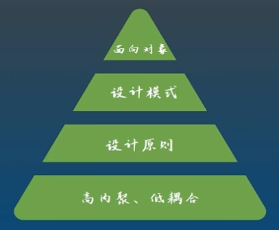
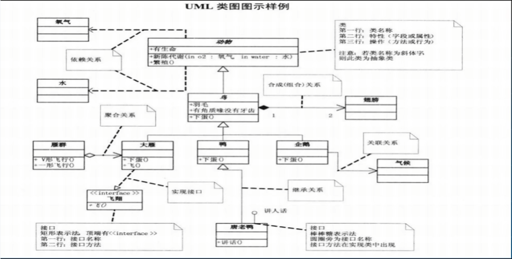
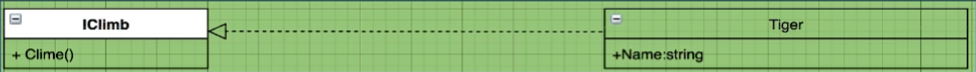
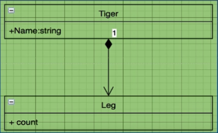
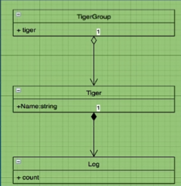
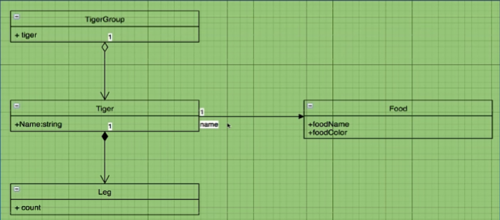
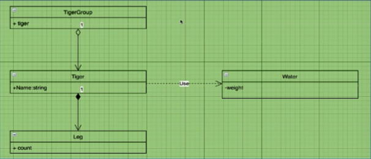
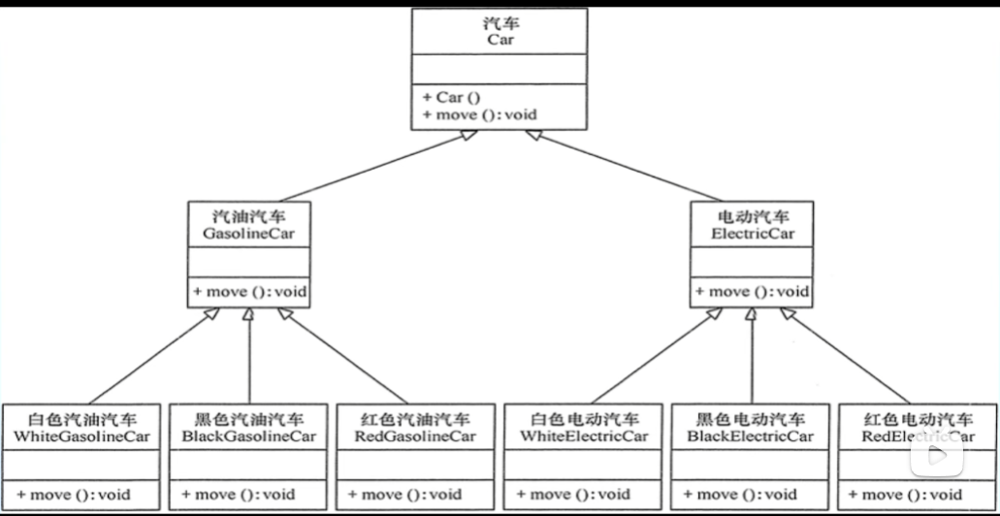
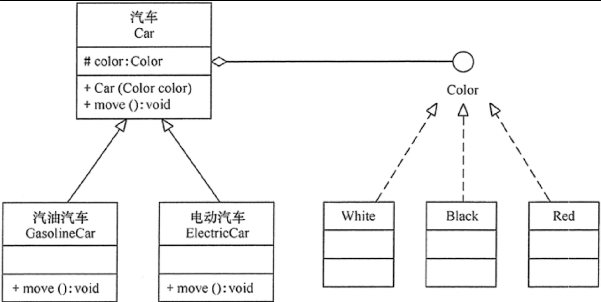
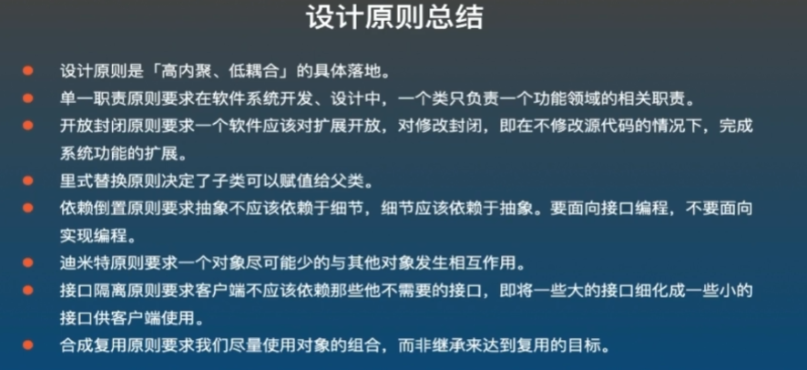

## 前言

这里是我学习编程思想的笔记，有需要的同学可以看看。

若发现有误，请尽量向我提出(qq 88595433 , email glom@skillw.com)



<!-- truncate -->

## 基础

### 高内聚 低耦合

##### 模块内部元素的相似程度高
##### 模块之间的依赖程度低

> 模块，即可以输入输出的一个整体 （例如 一个方法 一个类 一个项目都是）

##### 高内聚低耦合是整个编程思想的基础，是编程的最终目的

### 类与类之间的关系

##### 泛化 实现 组合 聚合 关联 依赖



#### 泛化 (继承)

类与类间的关系

Animal 是 Tiger 的泛化，Tiger 是 Animal 的特化


#### 实现

类与接口间的关系



#### 组合 (强拥有)

整体和部分的关系

个体/部分没有独立的生命周期，与整体的[生命周期](https://baijiahao.baidu.com/s?id=1699294221762201695&wfr=spider&for=pc)保持一致

组合是把个体类对象作为整体类的成员对象



#### 聚合 (弱拥有)

整体与部分的关系

个体有独立的生命周期

聚合是把个体类对象的指针(引用)作为整体类的属性



#### 关联

一种拥有关系，不分强拥有弱拥有 （注意与 聚合/组合 的区别）

关联是使一个类知道另一个类的属性或方法



#### 依赖

依赖是一种使用关系



### 总结

若 A 要用到 B，则箭头是由 A 到 B


## 设计原则

### 单一职责 [SRP]

Single Responsibility Principle

- 一个类只干一件事
- 有且只有一个引起类改变的原因

> 两大原因:
> 
> 内部改变 - 需要更改方法代码 -> 不能改此类代码
> 
> 外部改变 - 需要增加方法 -> 只能有这一个原因

##### 解决方法:

面向抽象编程，把类中方法代码改为接口的调用

（同类型的方法提到同一个接口中）

### 开放封闭原则 [OCP]

Open Closed Principle

##### 面向对象所有原则的核心 面向对象设计的终极目标

- 对功能扩展开放，面向修改代码封闭

即：当需求改变时，在不修改已有代码的前提下，通过拓展功能，使其满足需求

并且只能改某个点的代码，而不是牵一动百

##### 解决方法:

面向抽象编程，使用抽象封装变化

### 里氏替换原则 [LSP]

Liskov Substitution Principle

- 子类可以替换父类


### 接口分离原则 [ISP]

Interface Segragation Principle

##### 设计接口时采用，但首先必须满足单一职责原则

- 客户端不应该依赖它不需要的接口
- 一个类对另一个类的依赖应该建立在最小接口上

> 单一职责原则 -> 高内聚
> 
> 接口隔离原则 -> 低耦合

##### 解决方法

接口尽量细分，不要在一个接口中放很多方法

### 依赖倒置原则 [DIP]

Dependence Inversion Principle

##### 开放封闭原则的基础

- 高层模块(调用者) 不应该依赖于 低层模块(被调用者)，都应依赖于抽象
- 抽象不应依赖于实现，实现应依赖于抽象
- 本质 通过抽象是各个模块的实现彼此独立，互不影响，实现模块间的松耦合

> 依赖：存在模块 A, B
> 
>  A的变化有没有可能引起B的变化，如果有可能，那么B是依赖于A的。这里的变化是指需不需要修改代码。

##### 解决方法:  通过接口依赖

你可以：

- 通过方法传递
- 通过构造方法传递
- 通过属性的set方法传递

### 迪米特原则/最少知识原则

##### 设计类时采用

- 一个对象应该对其他对象有最少的了解
- 降低类之间的耦合

##### 解决方法

只和直接朋友通信

> 直接朋友:
> 
> 1. 成员对象
> 2. 方法参数
> 3. 方法返回值
> 
> 出现在局部变量中的类，不是直接朋友

### 合成复用原则 [CRP]

Composite Reuse Principle

###### 将已有对象纳入到新对象中，作为新对象的对象成员来实现，新对象可以调用已有对象的功能，从而达到复用

- 尽量使用对象组合而不是继承来达到复用

##### 继承的问题

- 破坏了系统的封装性，基类发生了改变，子类的实现也会改变
- 子类可能不需要父类某个方法，那么系统耦合性会变高
- 继承是静态的，不能在运行时发生改变

##### 解决方法

"拥有"组合， "是"继承。

上面显得非常臃肿，不符合合成复用原则，下图为解决办法



### 总结

设计原则是高内聚低耦合的具体体现



## 设计模式

### 单例模式

在程序运行中，保证某一个类，有且只有一个实例

#### 饿汉式

```java
class LazyManSingle {
    private static final LazyManSingle INSTANCE = new LazyManSingle();

    private LazyManSingle(){

    }

    public static LazyManSingle getInstance() {
        return INSTANCE;
    }

}
```

缺点：

单例在类初始化时就实例化了，但客户可能不会用这个单例，就造成了资源的浪费。

解决办法即 懒汉式(Lazy) 或 内部静态类 或 枚举

#### 懒汉式

```java
class LazyManSingle {
    private static LazyManSingle instance;

    private LazyManSingle(){

    }

    public static LazyManSingle getInstance() {
        if (instance == null) {
            instance = new LazyManSingle();
        }
        return instance;
    }
}
```

缺点：

不是线程安全的

如果有个客户多线程调用，那就会寄

```java
public class Main {
    public static void main(String[] args) {
        for (int i = 0; i < 10; i++) {
            new Thread(() -> {
                LazyManSingle single = LazyManSingle.getInstance();
                single.print();
            }).start();
        }
    }
}

class LazyManSingle {
    private static LazyManSingle instance;

    private LazyManSingle(){

    }

    public static LazyManSingle getInstance() {
        if (instance == null) {
            instance = new LazyManSingle();
            System.out.println("Construct!");
        }
        return instance;
    }

    public void print() {
        System.out.println(this.hashCode());
    }
}
```

运行结果如下：

```
Construct!
2069791201
2069791201
2069791201
2069791201
Construct!
2069791201
2069791201
2069791201
2069791201
Construct!
2069791201
2069791201
进程已结束。
```

可以发现，虽然拿到的单例都是同一个，但程序运行过程中实例化了 3 次，浪费了内存。

所以为了防止有客户这样做，我们应该写线程安全的懒汉式单例

#### 线程安全的懒汉式

即用即造，造完之后直接用

```java
public class Main {
    public static void main(String[] args) {
        for (int i = 0; i < 10; i++) {
            new Thread(() -> {
                LazyManSingle single = LazyManSingle.getInstance();
                single.print();
            }).start();
        }
    }
}

class LazyManSingle {
    private static volatile LazyManSingle instance;

    private LazyManSingle(){

    }

    public static LazyManSingle getInstance() {
        if (instance == null) {
            synchronized (LazyManSingle.class) {
                if (instance == null) {
                    instance = new LazyManSingle();
                    System.out.println("Construct!");
                }
            }
        }
        return instance;
    }

    public void print() {
        System.out.println(this.hashCode());
    }
}
```

使用同步锁：防止多个线程同时执行

双重判断：让在赋值后的线程直接返回，而不是进锁

volatile：避免[指令重排](https://baijiahao.baidu.com/s?id=1701616903992143186&wfr=spider&for=pc)

运行结果如下：

```
Construct!
2069791201
2069791201
2069791201
2069791201
2069791201
2069791201
2069791201
2069791201
2069791201
2069791201
```

如此这般，我们便得到了一个 线程安全的懒汉式单例

此外，还有一种方法实现单例，即内部静态类

#### 内部静态类

也可以实现懒加载

```java
public class Main {
    public static void main(String[] args) {
        LazyManSingle single = LazyManSingle.getSingle();
        single.print();
    }
}

class LazyManSingle {
    public static LazyManSingle getSingle() {
      //执行这一行时才会实例化
        return Inner.single;
    }

    private LazyManSingle(){

    }

    public void print() {
        System.out.println(this.hashCode());
    }

    public static class Inner {
        private static final LazyManSingle single = new LazyManSingle();
    }
}
```

但是！由于 java 中有反射 API 这种变态的存在，以上所有的私有构造方法在反射面前都是毛毛雨。

```java
Constructor<?> constructor = LazyManSingle.class.getDeclaredConstructors()[0];
constructor.setAccessible(true);
Object o = constructor.newInstance();
```

可谓防君子不防小人，所以我们要用到 枚举式

#### 枚举式

```java
public enum LazyManSingle {
    INSTANCE;
    public void print(){
        System.out.println(this.hashCode());
    }
}
```

#### 总结

饿汉式：如果一定会用这个单例，就用饿汉式

懒汉式： 单线程应用

线程安全的懒汉式：多线程应用

枚举式：仅限 java，完美解决


